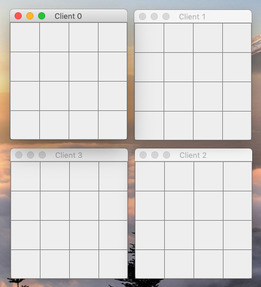
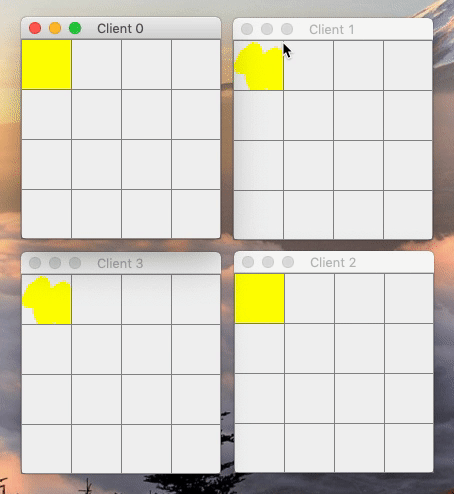
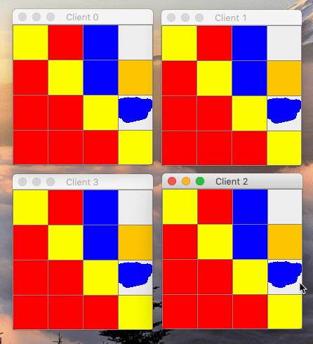
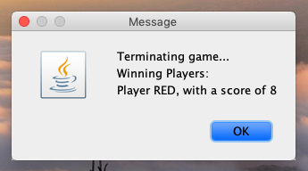

# Deny & Conquer
Deny & Conquer is a fun game implemented in Java used to demonstrate various distributed system aspects like clock synchronization, coordination, and fault tolerance.

In terms of the gaming aspect, the goal of the player is to color more cells than the opponent. Before a game session, the host can configure game settings like coloring width, number of cells on the grid, and percentage threshold of a cell. Once the threshold is met, then the player owns the cell. No two players can color the same cell at the same time. A player cannot color multiple cells at the same time.

#### System Design:

## Screenshots:
**_Configure Game Settings_** 

**_Game Starting Screens_** 

**_Gameplay (beginning)_** 

**_Gameplay (end)_** 

**_Results Screen_** 

